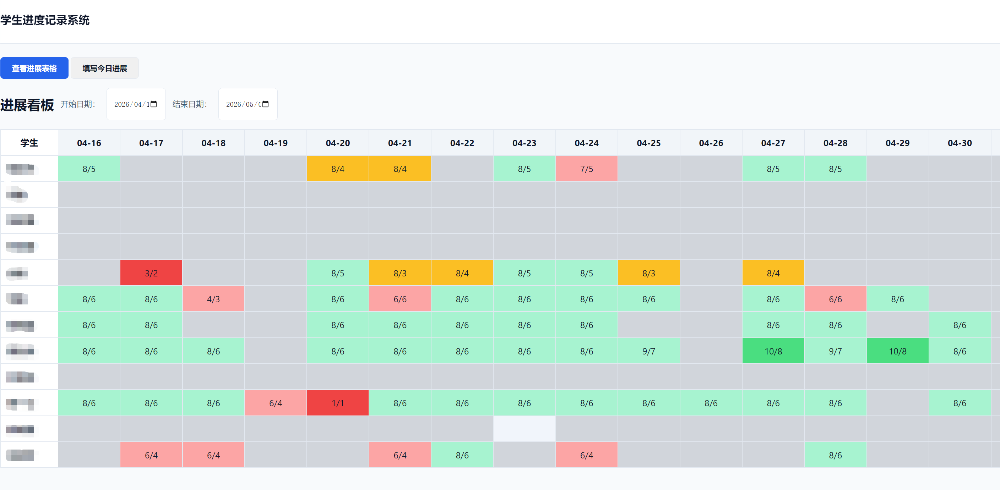
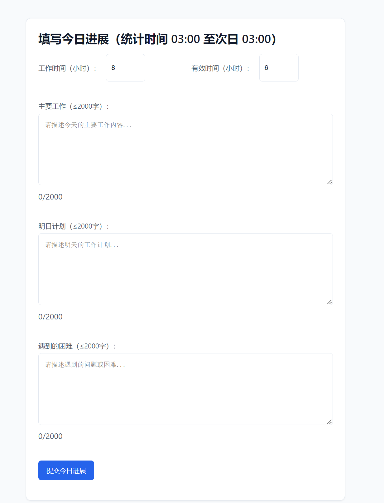
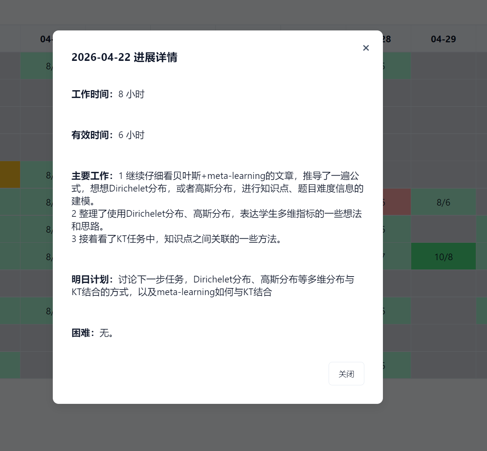

# 学生简易日报系统

一个基于 Flask + React 的学生简易日报系统，包含学生登录、每日进度填报、用户管理和邮件日报功能。

推荐使用方式：

- 项目主体推荐使用 Docker 启动
- 用户管理端推荐在本地单独启动 `python backend/admin.py`

这样更适合日常使用：主服务部署更稳定，管理端维护也更直接。

## 界面示意

### 进展看板



### 日报填写页



### 详情信息



## 项目结构

```text
student-simple-daily-report/
├── README.md
├── .gitignore
├── docker-compose.yml
├── backend/
│   ├── app.py                 # 后端主应用
│   ├── admin.py               # 用户管理页
│   ├── config.py              # 后端配置
│   ├── database.py            # 数据库初始化
│   ├── models.py              # 数据模型
│   ├── smtp.py                # 日报邮件发送
│   ├── cron_entry.sh          # Docker 定时任务入口
│   └── Dockerfile             # 后端镜像
├── frontend/
│   ├── package.json
│   ├── .env.local             # 本地前端环境变量，可自行创建
│   ├── src/
│   │   ├── config.js          # 前端接口地址配置
│   │   ├── services/
│   │   │   └── api.js         # 前端 API 封装
│   │   └── components/
│   │       ├── Login.jsx
│   │       └── Dashboard.jsx
│   └── Dockerfile             # 前端镜像
├── nginx/
│   └── nginx.conf             # Nginx 反向代理配置
├── instance/                  # 非仓库自带目录，需运行后或手动创建
│   ├── progress.db            # SQLite 数据库，运行后生成
│   └── recipients.csv         # 日报邮件收件人列表，需自行创建
└── build/                     # 前端打包产物，部署前生成
```

自检时重点确认这些文件或目录存在：

- `backend/app.py`
- `backend/admin.py`
- `frontend/package.json`
- `frontend/src/config.js`
- `docker-compose.yml`
- `nginx/nginx.conf`
- `instance/recipients.csv`（需自行创建，后续会说明填写规则）

注意：`instance/` 不是仓库自带目录，需要你在本地运行前手动创建，或由程序首次运行后生成。

## 如何启动

### 本地启动

除非特别说明，下面所有命令均在项目根目录执行。


1. 在项目根目录安装后端依赖

```bash
python -m venv .venv
source .venv/bin/activate
pip install flask flask-sqlalchemy flask-cors werkzeug Jinja2
```

2. 在项目根目录配置后端环境变量

本机直接运行时，建议先在当前终端执行：

```bash
export SECRET_KEY="please-change-this"
export DB_PATH="instance/progress.db"
export SMTP_SERVER="smtp.exmail.qq.com"
export SMTP_PORT="465"
export EMAIL_ADDRESS="your@example.com"
export EMAIL_PASSWORD="your-password"
export RECIPIENTS_CSV="instance/recipients.csv"
export FLASK_APP="backend/app.py"
```

特别说明，SMTP_SERVER、SMTP_PORT、EMAIL_ADDRESS、EMAIL_PASSWORD 需要配置对应的SMTP服务器、端口、邮箱地址、邮箱密码。这里仅以腾讯企业邮箱为例。

`RECIPIENTS_CSV` 用来指定日报邮件收件人列表文件路径，通常填写为 `instance/recipients.csv`。

如果你暂时不用邮件日报，`EMAIL_ADDRESS`、`EMAIL_PASSWORD`、`RECIPIENTS_CSV` 可以先不配。

3. 在项目根目录启动后端

```bash
mkdir -p instance
python -m flask run --host=0.0.0.0 --port=5000
```

后端默认使用 `instance/progress.db`，首次启动会自动建表。

4. 在 `frontend/` 目录配置本地前端接口地址

本地开发时，前端和后端通常是分开启动的：

- 前端开发服务器：`http://127.0.0.1:3000`
- 后端接口服务：`http://127.0.0.1:5000`

因此，`REACT_APP_API_BASE_URL` 需要明确指向后端接口地址。

这里默认写成：

```env
REACT_APP_API_BASE_URL=http://127.0.0.1:5000/api
```

原因：

- `127.0.0.1` 表示“当前这台机器本机”
- `5000` 是本项目本地运行 Flask 的默认端口
- `/api` 是后端接口统一前缀

也就是说，这个配置适用于“前后端都跑在你自己的这台电脑上，本地浏览器直接访问”的场景。

常见情况可以这样改：

1. 本机本地开发

前端和后端都在同一台电脑上运行，保持默认即可：

```env
REACT_APP_API_BASE_URL=http://127.0.0.1:5000/api
```

2. 本机本地开发，但你想用 `localhost`

也可以改成：

```env
REACT_APP_API_BASE_URL=http://localhost:5000/api
```

当前项目后端已配置为 `CORS` 全允许，所以这里通常不需要再单独改白名单；如果后续改回按域名限制，再同步放行对应前端地址即可。

3. 局域网内从另一台设备访问

如果前端页面是从手机、平板或另一台电脑访问你的开发机，那么 `127.0.0.1` 就不能用了，因为它只代表“访问者自己的机器”。

这时应改成你开发机的局域网 IP，例如：

```env
REACT_APP_API_BASE_URL=http://192.168.1.10:5000/api
```

同时需要满足：

- 后端已用 `--host=0.0.0.0` 启动
- 防火墙已放行对应端口
- 如果你后续把 `CORS` 改回按域名限制，需要把前端实际访问地址加入允许列表，例如 `http://192.168.1.10:3000`

4. Docker + Nginx 统一反向代理

如果你是通过 `docker compose` 启动，并由 Nginx 统一转发接口，那么前端通常不需要写死后端主机和端口，直接走同源代理即可：

```env
REACT_APP_API_BASE_URL=/api
```

本项目前端默认配置本身就支持这种写法；如果不额外设置，生产部署通常也建议保持 `/api`。

5. 线上部署到正式域名

如果前端和后端通过同一个域名访问，也建议写成：

```env
REACT_APP_API_BASE_URL=/api
```

如果前后端分属不同域名，再改成完整地址，例如：

```env
REACT_APP_API_BASE_URL=https://your-domain.com/api
```

总结：

- 本机直跑：`http://127.0.0.1:5000/api`
- 局域网调试：`http://你的局域网IP:5000/api`
- Docker / Nginx / 同域部署：`/api`
- 独立线上接口域名：`https://你的域名/api`

5. 在 `frontend/` 目录启动前端

```bash
cd frontend
npm install
npm start
```

默认访问地址：

- 前端：`http://127.0.0.1:3000`
- 后端：`http://127.0.0.1:5000`

## 如何添加用户

### 方式一：使用管理端

管理端支持新增用户、删除用户、修改密码。

在项目根目录执行：

```bash
export SECRET_KEY="please-change-this"
export DB_PATH="instance/progress.db"
python backend/admin.py
```

访问：

- `http://127.0.0.1:5001/admin`

填写以下信息即可创建用户：

- `username`：登录用户名，必须唯一
- `name`：显示姓名
- `password`：初始密码

这里不需要填写 `email`。系统用户信息和日报邮件收件人列表是分开的。

### 方式二：初始化测试数据

在项目根目录执行：

```bash
export FLASK_APP="backend/app.py"
export DB_PATH="instance/progress.db"
python -m flask init-db
```

该命令会清空现有数据，并创建 3 个测试用户：

- `zhangsan / 123456`
- `lisi / 123456`
- `wangwu / 123456`

只建议在本地演示或首次空库测试时使用，不要在已有数据环境执行。

## recipients.csv 说明

`instance/recipients.csv` 用于配置“谁会收到每日邮件报告”。它只给日报邮件使用，不参与登录，也不会自动创建系统用户。

推荐格式：

```csv
email,name
alice@example.com,张三
bob@example.com,李四
```

字段说明：

- `email`：收件人邮箱地址，日报邮件会发送到这里
- `name`：收件人姓名或备注，方便维护；当前程序不会在发送时使用这一列

填写规则：

- 第一行建议保留表头 `email,name`
- 一行一个收件人
- `email` 必填
- `name` 选填，可以写中文名，也可以写备注
- 如果有重复邮箱，程序会自动去重

如果你只想维护邮箱，也可以写成单列：

```csv
alice@example.com
bob@example.com
```

本机运行时，通常配合下面这条环境变量一起使用：

```bash
export RECIPIENTS_CSV="instance/recipients.csv"
```

## 注意事项

- `init-db` 会执行删库重建，请勿在生产环境或已有数据环境使用。
- 管理端目前没有登录保护，不要直接暴露到公网。
- 默认数据库路径是 `instance/progress.db`，公开仓库时不要提交数据库文件。
- 本机直接运行后端或管理端时，请先在项目根目录所在终端用 `export XXX=...` 配好环境变量。
- Docker 运行时，请在项目根目录写 `.env`，不要把本机 `export` 和 Docker `.env` 混用。
- `SECRET_KEY`、邮箱账号、邮箱密码等敏感配置请通过环境变量或 `.env` 管理，不要提交到 GitHub。
- 当前后端 `CORS` 为全部允许，便于本地开发、局域网调试和临时联调；如果用于正式公网环境，建议按实际域名收紧。
- 系统按 `Asia/Shanghai` 时区，并以凌晨 `3:00` 作为一天的分界点。
- 删除用户时会同时删除该用户的进度数据。

## Docker 使用

### 1. 准备环境变量

在项目根目录创建 `.env`，至少包含以下内容：

```env
SECRET_KEY=please-change-this
DB_PATH=instance/progress.db
SMTP_SERVER=smtp.exmail.qq.com  #邮箱服务器，注意这里是以腾讯企业邮箱为例，其他邮箱需要配置对应的SMTP服务器
SMTP_PORT=465
EMAIL_ADDRESS=your@example.com  #邮箱地址
EMAIL_PASSWORD=your-password  #邮箱密码
REPORT_TIME=06:00
TIMEZONE=Asia/Shanghai
RECIPIENTS_CSV=/app/instance/recipients.csv
```

如果暂时不需要日报邮件，请不要启动 `daily_report` 服务，或先补齐邮件相关配置。

其中：

- `EMAIL_ADDRESS`：发件邮箱
- `EMAIL_PASSWORD`：发件邮箱密码或授权码
- `RECIPIENTS_CSV`：容器内收件人列表文件路径，对应宿主机里的 `instance/recipients.csv`

### 2. 准备前端静态文件

当前 `docker-compose.yml` 直接挂载项目根目录的 `build/` 目录。

先在项目根目录执行：

```bash
cd frontend
npm install
npm run build
rm -rf ../build
cp -r build ../build
```

### 3. 启动容器

回到项目根目录执行：

```bash
docker compose up -d --build
```

默认访问地址：

- 页面入口：`http://127.0.0.1:14080`

### 4. Docker 环境中添加用户

可以临时拉起管理端容器：

在项目根目录执行：

```bash
docker compose run --rm -p 5001:5001 backend python backend/admin.py
```

然后访问：

- `http://127.0.0.1:5001/admin`

该管理端会复用当前挂载的 `./instance` 数据目录。

### 5. 停止服务

在项目根目录执行：

```bash
docker compose down
```